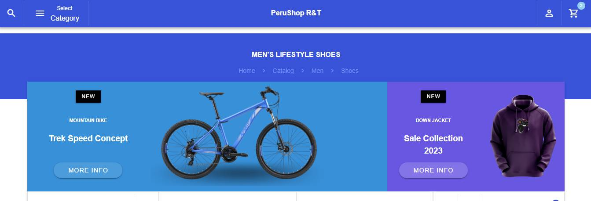
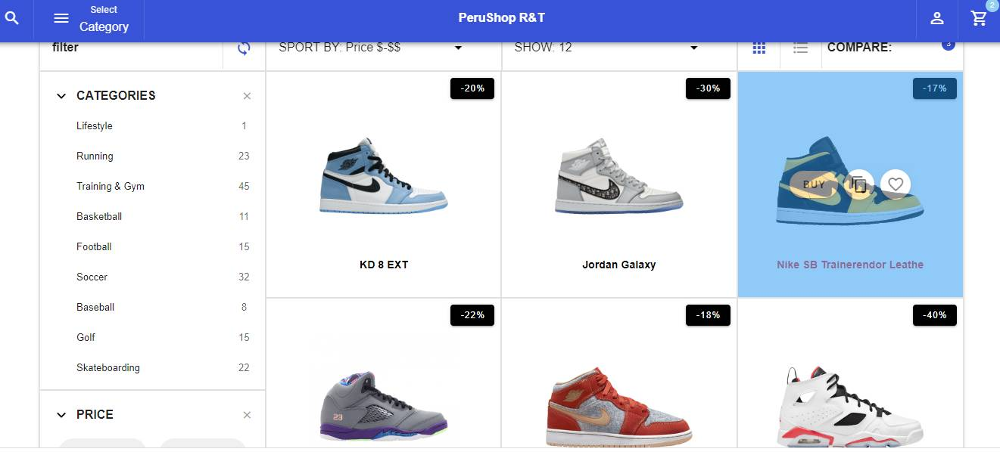
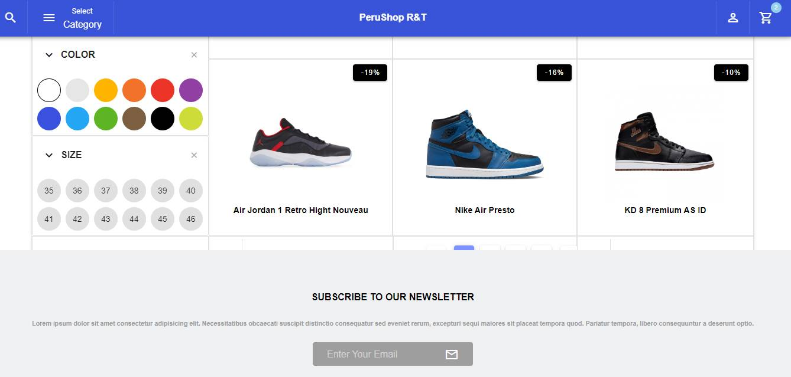
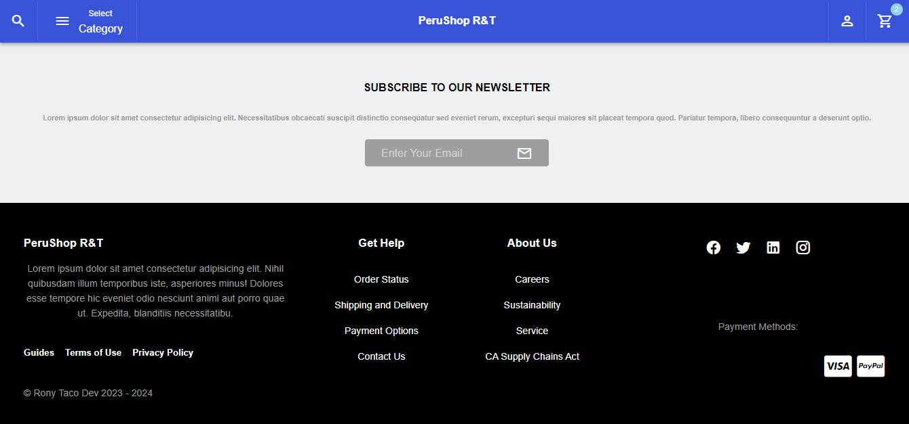

# Ecommerce-PeruShop-rt :credit_card:

How to design and create an ecomerce website using  vuetify and  vue.js  , material design icons, Font Awesome icons.

## TARGETS :pushpin: :rocket:
* Create an Navbar and Footer
* Create a dashboard with many options like check Color and Size, Hover and Pagination.

## COMMANDS 
* vue create ecommerce-perushop-rt
* cd ecommerce-perushop-rt
* vue add vuetify
* npm install material-design-icons-iconfont -D
* npm install @fortawesome/fontawesome-free -D
* npm run serve

## STACK TECH :wrench: :hammer:

* Vue 2
* Vuetify
* Vue Router
* Fontawesome
* Material Design

## SCREENSHOT









## Project setup
```
npm install
```

### Compiles and hot-reloads for development
```
npm run serve
```

### Compiles and minifies for production
```
npm run build
```

### Lints and fixes files
```
npm run lint
```

### Customize configuration
See [Configuration Reference](https://cli.vuejs.org/config/).
